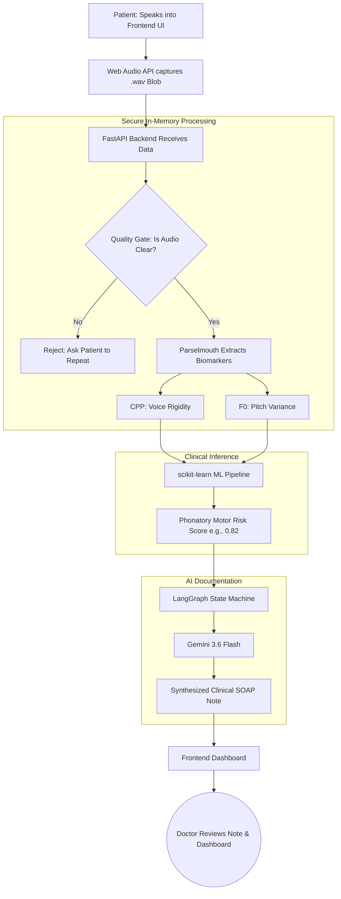

# 🎙️ NeuralEcho: Hackathon Pitch & Project Documentation

Welcome to the complete project breakdown for **NeuralEcho**. This document is specifically formatted to be used for hackathon submissions (like Devpost), presentations to judges, or your main `README.md`. It hits all the critical evaluation criteria judges look for: clear problem statement, innovative solution, technical depth, and user-centric design.

---

## 1. 🚨 Problem Understanding: The "Silent Progression" Gap

**The Core Issue:** Over 70% of neurodegenerative degradation occurs invisibly between episodic hospital visits. 

Diseases like Parkinson's Disease (PD) and Amyotrophic Lateral Sclerosis (ALS) are progressive. Today, clinical assessments rely on subjective observations made during infrequent doctor's appointments (every 3 to 6 months). 
*   **For the Patient:** Their condition silently worsens at home, leading to unexpected emergencies or falls.
*   **For the Clinician:** They lack continuous, objective data to adjust medications proactively.
*   **The Bottleneck:** Traditional Remote Patient Monitoring (RPM) requires expensive hardware (wearables) that elderly patients often forget to charge or wear.

> [!IMPORTANT]
> **The Insight:** Changes in a patient's voice (vocal fold micro-tremors, rigidity, loss of pitch variation) manifest *long before* gross motor symptoms (like hand tremors or limb rigidity) become visually apparent.

---

## 2. 💡 Proposed Solution

**NeuralEcho** is a frictionless, software-only Remote Patient Monitoring (RPM) platform that analyzes sub-perceptual vocal biomarkers to detect neurodegenerative decline early.

Instead of wearing hardware, the patient simply speaks into their smartphone or computer once a week. 
1.  **Guided Acoustic Battery:** The app guides the user through standard clinical vocal exercises (e.g., sustained "Ahhh", rapid "Pa-Ta-Ka" DDK rates).
2.  **Biomarker Extraction:** The system extracts advanced acoustic features like **CPP** (Cepstral Peak Prominence) and **F0** (Fundamental Frequency) that measure vocal cord rigidity.
3.  **Deterministic ML:** A trained Neural Network calculates a **Phonatory Motor Risk Score** (the probability of pathological decline).
4.  **Generative AI Synthesis:** An LLM agent takes the raw data and risk scores and formats them into a standard, professional medical **SOAP note** for the clinician's dashboard, ensuring the doctor gets actionable insights, not just raw numbers.

---

## 3. 👥 Target Users

NeuralEcho is a B2B2C platform serving a dual-sided ecosystem:

### 1. Neurologists & Clinicians (Primary Users)
*   **Needs:** Objective, longitudinal data to track disease progression between visits. Clear documentation.
*   **Value:** NeuralEcho flags high-risk patients instantly and auto-generates SOAP notes, saving hours of administrative work and enabling proactive, rather than reactive, care.

### 2. Patients with Neurodegenerative Diseases (End Users)
*   **Needs:** Easy-to-use, non-intrusive monitoring that doesn't require learning complex technology.
*   **Value:** Peace of mind. They know their doctor is tracking their progression using just their phone's microphone.

### 3. Clinical Trial Investigators
*   **Needs:** Objective digital endpoints to prove if a new Alzheimer's or Parkinson's drug is working.
*   **Value:** A scalable, decentralized way to track drug efficacy across thousands of patients remotely.

---

## 4. 🛠️ Tech Stack & Defensible Architecture

We chose this stack to balance rapid prototyping with enterprise-grade clinical security.

### Frontend (Immersive Clinical UI)
*   **React 19 & Vite:** Lightning-fast SPA.
*   **Tailwind CSS v4 & Framer Motion:** For a highly polished, trustworthy, and modern UI.
*   **React Three Fiber & Three.js:** 3D WebGL visualizations (Particle Vortex) to provide biofeedback while the patient speaks, keeping them engaged.
*   **Web Audio API:** High-fidelity microphone capture.

### Backend (Secure Processing)
*   **FastAPI (Python):** High-performance async backend.
*   **Parselmouth / Praat:** The gold standard in acoustic phonetics software for extracting CPP and F0 features accurately.
*   **Zero-Trace Architecture:** Audio is processed 100% in-memory (`io.BytesIO`). **No WAV files are ever saved to disk**, ensuring absolute HIPAA compliance and biometric privacy.

### AI & Machine Learning
*   **Scikit-Learn (MLP Neural Network):** A Feedforward Neural Network pipeline (with SMOTE for data balancing) to deterministically output the disease probability score.
*   **Google Gemini 3.6 Flash:** Blazing fast LLM inference.
*   **LangGraph:** Enforces a strict state-machine workflow around the LLM to prevent AI "hallucinations." The LLM is strictly constrained to formatting data, not diagnosing.

---

## 5. 🗺️ Development Plan (The 24-Hour Sprint & Beyond)

**What We Built in 24 Hours (Hackathon Execution)**
*   **Hours 0-6 (Foundation):** Architected the decoupled system. Built the React + Vite frontend skeleton and secure Web Audio API microphone capture.
*   **Hours 6-12 (Data & Analysis):** Developed the FastAPI backend. Implemented the zero-trace in-memory audio routing and integrated Praat/Parselmouth for acoustic biomarker extraction (CPP & F0).
*   **Hours 12-18 (Machine Learning):** Built and trained the deterministic scikit-learn MLP model using SMOTE for data balancing. Connected the inference pipeline to the FastAPI endpoint.
*   **Hours 18-24 (AI & Polish):** Integrated LangGraph and Gemini 3.6 Flash for automated SOAP note generation. Finalized the immersive 3D Three.js UI, animations, and the clinical dashboard visualizations.

**Next 30 Days (MVP Polish)**
*   Integrate Auth0 for secure Patient/Doctor RBAC (Role-Based Access Control).
*   Connect a secure Postgres database for persistent, encrypted longitudinal patient histories.
*   Implement background noise-cancellation (WebRTC) to handle poor microphone quality.

**Next 6 Months (Clinical Validation)**
*   Deploy in a pilot program with a local neurology clinic.
*   Compare NeuralEcho's risk scores against standard UPDRS (Unified Parkinson's Disease Rating Scale) tests.
*   Prepare for FDA pre-submission (Software as a Medical Device - SaMD).

---

## 6. 🔄 Design & Workflow

Our architecture is strictly decoupled to ensure the AI components are verifiable and safe.

> [!TIP]
> **Judge Hook:** Emphasize to the judges that you do not use Generative AI to diagnose the patient. You use a deterministic, math-based Neural Network to score the risk, and *only* use Generative AI (Gemini) to format that data for the doctor. This proves you understand clinical safety.

### System Workflow

